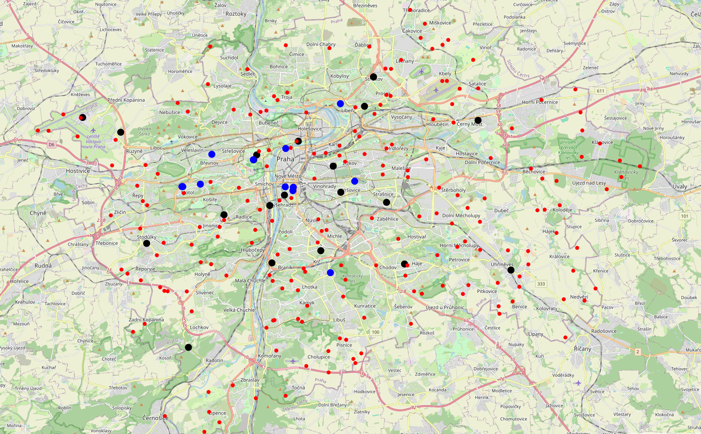
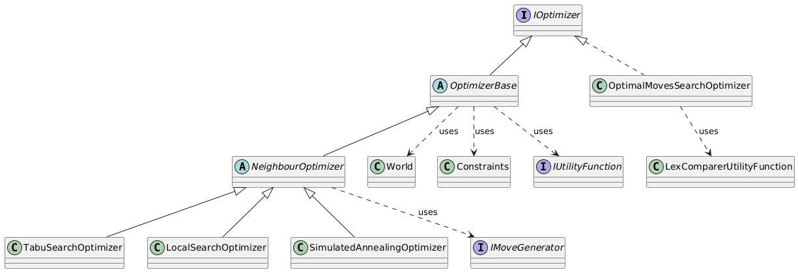
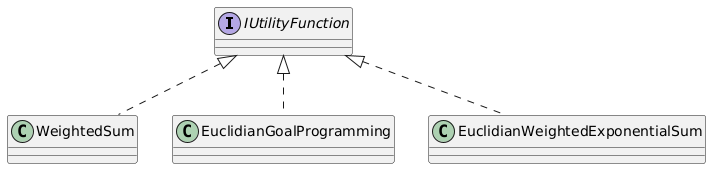
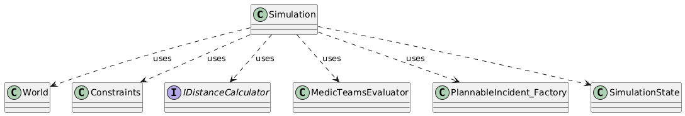

# User documentation

## Installation guide

This project is a library implemented in C# (.NET 8), which implements optimizers for finding optimal emergency service plans.
Here is an example usage:

To use this library, `.NET 8` is needed. Simply add the `.dll` to your `bin` folder and reference it. You can also create your own `nuget`, or reference the project directly within your `.csproj` file.
Once the appropriate reference is added, you can build your own application as usual (eg. `dotnet build`) and it will also build and restore all necessary dependencies.

## Usage guide

```cs
PragueInput input = new PragueInput();
var world = input.GetWorld();
Constraints constraints = input.GetConstraints();
ShiftTimes shiftTimes = input.GetShiftTimes();
  
IDistanceCalculator distanceCalculator = new RealDistanceCalculator(
  world.Hospitals
);

Simulation simulation = new(world, constraints, distanceCalculator);
IUtilityFunction utilityFunction = new WeightedSum(EmergencyServicePlan.GetMaxCost(world, shiftTimes));
IMoveGenerator moveGenerator = new AllBasicMovesGenerator(shiftTimes, constraints);
var optimizer = new LocalSearchOptimizer(int.MaxValue, world, constraints, distanceCalculator, utilityFunction, moveGenerator);

var incidents = input.GetMondayIncidents(300, new Random(420));
var optimal = optimizer.GetBest(incidents.AsSpan()).ToList().First();
```

In this example, we use already provided model of Prague's emergency service.
Using random seed, we can sample random incidents, that model how incidents could really happen.
We than create a `distanceCalculator`, which uses Google API for calculating distances.
For that to work, you need to provide API key in class `ApiKeyParser` for Google API. You need to enable Distance Matrix API and Routes API.
You can implement your own distance calculator, implementing `IDistanceCalculator` interface.

Distance calculator is used in `Simulation` class. This class simulated behaviour of an emergency plan on given set of incidents.
Simulation is used in `IUtilityFunction` implementation. Here we use `WeightedSum` utility function, but the library provides some more.

In this example, we use `LocalSearchOptimizer` optimizer. This optimizer also needs a way, how to navigate from plans using neighborhoods.
These are implicitly defined by moves, which can be done in a given plan. What moves can be done is defined by `IMoveGenerator` implementation.
In this example, we use `AllBasicMovesGenerator`.

Finally, we can create an instance of `LocalSearchOptimizer`, having a way how to calculate utility of a plan how to navigate in the emergency service plan's space.
We then can create a set of incidents, that represents how incidents usually occur during a day. The optimizer by calling `GetBest` method will
then find the most optimal plan, defined by the utility function.

If you would like to visualize the found plan, you can use `GanttView` class. It is an implementation of basic gantt chart for the plan,
how it behaves on given incidents.

```cs
GanttView gantt = new(world, constraints);
gantt.Show(optimal, incidents.AsSpan(), writer);
```

This example writes to writer (default is `Console.Out`) how the plan behaves on the incidents set in time.
Example output can be found in file `exampleGantt`.

The example gantt chart is of a plan found by `OptimalMovesSearchOptimizer` optimizer.
Numbers on the left (eg. :18:0) represent depot number 18, team number 0.
The chart is visualized for the day in hours, where each '-' represents one minute of team's shift. When '-' is not present for the team, it means it is not allocated in this time.
Symbol `>` denotes plan traveling to the location of an incident. Symbol 'o' denotes handling of the incident on the location.
Symbol '=' denotes traveling to hospital and handling of the incident in the hospital.
Finally, symbol '<' denotes how the team travels back to depot. No symbol means the team doesn't do anything and rests on the depot.
At the end, you can find handled incidents count and total cost.

The gantt view is obtained by running simulation (`Simulation` class) on the given incidents set.
Gantt view is especially useful during inference, where it good to know more deeply how the team behaved on not seen incidents. 

Here is another example:

```cs

PragueInput input = new PragueInput();
var world = input.GetWorld();
Constraints constraints = input.GetConstraints();
ShiftTimes shiftTimes = input.GetShiftTimes();
var incidents = input.GetMondayIncidents(300, new Random(420));
  
IDistanceCalculator distanceCalculator = new RealDistanceCalculator(
  world.Hospitals
);

Simulation simulation = new(world, constraints);
IUtilityFunction utilityFunction = new WeightedSum(simulation, EmergencyServicePlan.GetMaxCost(world, shiftTimes));
IMoveGenerator moveGenerator = new AllBasicMovesGenerator(shiftTimes, constraints);
var optimizer = new SimulatedAnnealingOptimizer(world, constraints, utilityFunction, moveGenerator, startTemp: 5, finalTemp: 0.0000001, M_k: 10, coolingSchedule: new ExponentialCoolingSchedule(0.90), random: new Random(1));

OptimalMovesSearchOptimizer optimalOptimizer = new(world, shiftTimes, distanceCalculator, constraints, visitPlans: 1);
var optimalInCost = optimalOptimizer.GetBest(incidents).First();
optimizer.StartPlan = optimalInCost;

var optimal = optimizer.GetBest(incidents.AsSpan()).ToList().First();
GanttView gantt = new(world, constraints);
gantt.Show(optimal, incidents.AsSpan());

```

In this example, using `OptimalMovesSearchOptimizer` optimizer, plan optimal in cost is found, and used as a starting plan for `SimulatedAnnealingOptimizer` optimizer.
After the optimal one is found, we write it to `Console` using `GanttView`.

Thanks to already provided implementation of generating model of Prague's emergency services and synthetically generated set of incidents, it is easy to get started and 
get used to the API of the library. In order to use it on different emergency service, you have to create your own data - your own model of the emergency service and your set of incidents.
It is recommended to check `PragueInput` class for inspiration, when generating your own data.

Project `WorldMap` is used for visualization of your emergency service and incidents.
It's both windows and linux desktop application, build using Avalonia framework.
Here is visualized model of Prague and sample incidents: 



# Technical documentation

## Project structure
The project structure is as following:


`DataModel` project contains all data types and model classes.
Project `Simulating` contains everything related to emergency service plan simulation.
Project `Optimization` is the library that you want to add to your project.
It provides all optimizers, with utility functions etc ...

## Optimization library

This is the most important library, which is included and where all the logic of finding an optimal plan lies. 
Below is visualized optimizers hiearchy:



Everything implements `IOptimizer` which defines method `GetBest`.
Class `OptimizerBase` represents an optimizer, which finds best emergency plan using only some utility function, defined by `IUtilityFunction` interface.
Class `NeighbourOptimizer` represents optimizers, which for finding an optimal plan also uses some notion of neighbours, defined implicitly by moves - `IMoveGenerator` interface.
The optimal moves search optimizer does not implement `OptimizerBase`, because the utility function lex comparer has two arguments - it only works by comparing, not by producing some absolute value.
It also does not make sense to inherit from `NeighbourOptimizer`, because the move generation is very specific and cannot be parametrized by some `IMoveGenerator` instance.



This is the utility function hierarchy. Notice the lex comparer does not implement the interface `IUtilityFunction`.

### Move generation

Move generation is done by `IMoveGenerator` instance. The implementation is done in such a way, that there
are no limits on how the move should look like.
It is possible by using class `MoveSequence`, which has internal buffer of `Move`s, which can be arbitrarily long.
The `GetMoves` in `IMoveGenerator` returns `IEnumerable<MoveSequenceDuo>`. Class `MoveSequenceDuo` contains two
instance of `MoveSequence`, one is `Normal` move. This is the move, or rather say move sequence, to be actually made.
The other one is `Inverse` - this one is the inverse move of the normal move.

It is designed in this way, to allow for modifications of the currently searched emergency service plan (`EmergencyServicePlan` class).
One modification will make the `Normal` move and the other the `Inverse` move.
Thanks to this decision, there is no need to copy the whole `EmergencyServicePlan` instance, which not only saves memory,
but more crucially it saves a lot of time needed for copying the data (and possibly allocating on heap).

For implementers of `IMoveGenerator`, it is recommended to take a look at `AllBasicMovesGenerator` class.
There can be seen how to use `MoveGeneratorBase` classes methods, such as `AllocateTeam`, `ChangeShift` etc ...
These methods are very useful, since more complicated moves can usually be obtained by some sequence of these basic moves.

### Simulation

Simulation has to be very efficient. If you use some API to calculate route travels, what is for example the case for `RealDistanceCalculator`, than the calculation bottleneck is the API request. This can only be sped up by some cache mechanism (which `RealDistanceCalculator` uses), but it still is much slower than any other calculation done by the simulation.

For that reason, there is also `LineDistanceCalculator`, which does not call any API's, but instead calculates travel durations and also intermediate locations simply by making all trajectories as lines and using a Pythagorean theorem.
In this implementation calculating travel durations is very fast, compared to `RealDistanceCalculator` it's in hundreds of orders of magnitude, but the accuracy is not very good. Such an implementation of `IDistanceCalculator` can still be useful, for example as some kind of Surrogate Model.



In the diagram above, we can see what classes is simulation using.
Class `MedicTeamsEvaluator` is used for evaluating which medic team is the best one to choose to handle current incident.
Any logic related to successful handling of an incident is found here.
Class `PlannableIncident_Factory` calculates the durations of each phases for a team and an incident - travel duration, duration of handling on the incident, travel to hospital, handling of the incident in hospital and travel back from hospital to depot.
Here is extensively used `IDistanceCalculator`.

Class `SimulationState` encapsulates complete state of the simulation. Having such a class is extremely useful,
when you want to change the simulation's state manually, not only by simulation's calculations. It is also very useful when testing the simulation, since you can put the simulation in any state you would like and check if it behaves correctly.
This mechanism is extensively used in `OptimalMovesSearchOptimizer`, when generating optimal moves (see implementation of `GetMoves`).
